# Dokumentacja program kolory 
Autor: Alicja Janeczko 3G

___

## Budowa i funkcjonalości programu:

___

* App.java
* KolorRGB.java
    * przechowuje wartości kolorów RGB
* KolorCMYK.java
    * przechowuje wartości kolorów CMYK
* PorownanieJasnosci.java
    * zawiera metody porównujące dwa kolory i wypisujące informację o tym, który jest jaśniejszy i o ile:
        * porownajJasnosc()
        * toRGB()
        * lumin()
    * zawiera metody porównujące dwa kolory i wypisujące informacje jaka barwa jest dominująca w danym kolorze:
        * dominant()
        * rgbGetH()
* KolorPrzeciwny.java
    *  zawiera metody wypisujące wartości do koloru kontrastowego (przeciwnego):
       *  kolorPrzeciwny()
       *  kpRGB()
       *  kpCMYK()

___

## Opisy funkcji

___

### porownajJasnosc()
To funcja typu void. Odpowiada za:
* Rozpoznawanie przestrzeni barwy koloru poprzez sprawdzienie wielkości tablicy przechowującej wartości kolorów w przestrzeniach barw 
* Wywołanie funkcji odpowiadających za obliczenie względnej luminancji (jasności) koloru oraz dominującej barwy koloru
* Wypisanie na ekran informacje o tym, który kolor jest jaśniejszy (ma większą względną luminację-> w skali 0 - 100) i o ile

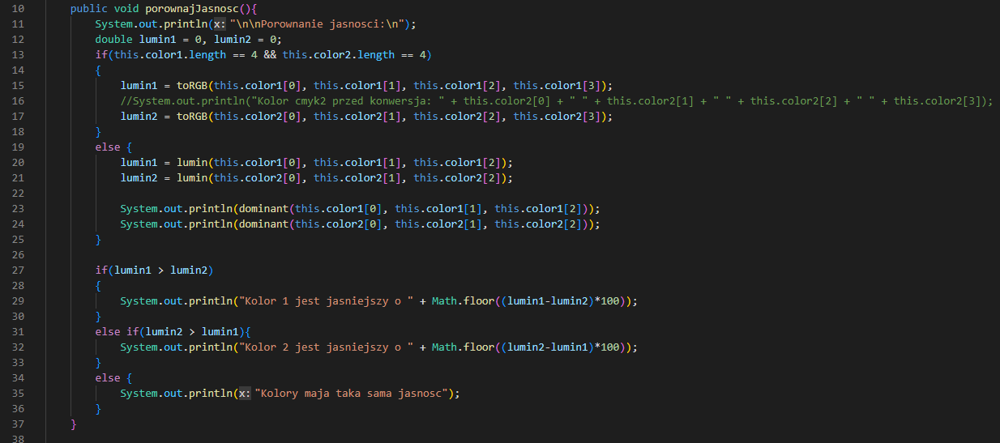

___

### toRGB()
To funkcja typu double, przyjmuje jako argumenty wartości c, m, y i k w zakresie 0 - 100 (przestrzeń barw CMYK). Zwraca funkcję lumin(). Odpowiada za:

* Zmianę przestrzeni barw z CMYK na RGB używając formuły:
> The R, G, B values are given in the range of 0 - 255. The red (R) color is calculated from the cyan (C) and black (K) colors:

    R = 255 × (1-C) × (1-K)   
> The green color (G) is calculated from the magenta (M) and black (K) colors:
    
    G = 255 × (1-M) × (1-K)  
> The blue color (B) is calculated from the yellow (Y) and black (K) colors:
    
    B = 255 × (1-Y) × (1-K)  
* Umożliwienie obliczenia względnej luminacji dla danego koloru z przestrzeni barw CMYK za pomocą przekonwertowania go do przestrzeni barw RGB, ponieważ nie ma żadnych rzetelnych źródeł w których został określony wzór na określenie postrzeganej jasności koloru CMYK
* Wywołanie funkcji **dominant()**

___

### lumin()
To funkcja typu double, przyjmuje jako argumenty wartości r, g, b w zakresie 0 - 255 (przestrzeń barw RGB). Zwraca obliczoną wartość względnej luminacji w zakresie 0 - 1. Odpowiada za:

* Obliczenie wartości względnej luminacji używając formuły zdefiniowanej przez *Web Content Accessibility Guidelines (WCAG)*:

>  Relative luminance is the relative brightness of any point in a colorspace, normalized to 0 for darkest black and 1 for lightest white. For the sRGB colorspace, the relative luminance of a color is defined as L = 0.2126 * R + 0.7152 * G + 0.0722 * B where R, G and B are defined as:

    if RsRGB <= 0.03928 then R = RsRGB/12.92 else R = ((RsRGB+0.055)/1.055) ^ 2.4
    if GsRGB <= 0.03928 then G = GsRGB/12.92 else G = ((GsRGB+0.055)/1.055) ^ 2.4
    if BsRGB <= 0.03928 then B = BsRGB/12.92 else B = ((BsRGB+0.055)/1.055) ^ 2.4

> and RsRGB, GsRGB, and BsRGB are defined as:

    RsRGB = R8bit/255
    GsRGB = G8bit/255
    BsRGB = B8bit/255

___

### dominant()

To funkcja typu String, przyjmuje jako argumenty wartości r, g, b w zakresie 0 - 255 (przestrzeń barw RGB). Zwraca barwę dominującą w danym kolorze. Odpowiada za:

* sprawdzenie, czy wartości składowych barwy są identyczne; jeśli tak, to barwą dominującą będzie biały, szary lub czarny
* wywołanie funkcji **rgbToHSV()**
* sprawdzenie i dopasowanie wartości **hue** pod odpowiadającą jej dominującą barwę w kolorze. Zgodnie ze źródłami:
   *  [24 hues of HSL/HSV](https://en.wikipedia.org/wiki/Hue), 
   *  [Hue Value Saturation](http://learn.leighcotnoir.com/artspeak/elements-color/hue-value-saturation/), 
   *  [CIELAB color space](https://en.wikipedia.org/wiki/CIELAB_color_space#CIELAB), 
   *  [Frank Preucil, "Color Hue and Ink Transfer … Their Relation to Perfect Reproduction, TAGA Proceedings, p 102-110 (1953)](documentation/images/hue.PNG)

   * **Przyjęty zakres hue (w stopniach):**
        * **red:** 0-35 i 345-360
        * **yellow:** 36 - 79
        * **green:** 80 - 165
        * **blue:** 166 - 250
        * **violet:** 251 - 344
 

___

### rgbGetH()

To funkcja typu double, przyjmuje jako argumenty wartości r, g, b w zakresie 0 - 255 (przestrzeń barw RGB). Zwraca Hue (odcień) w zakresie 0 - 360. Odpowiada za:

* Obliczenie wartości Hue (odcienia) podanego koloru

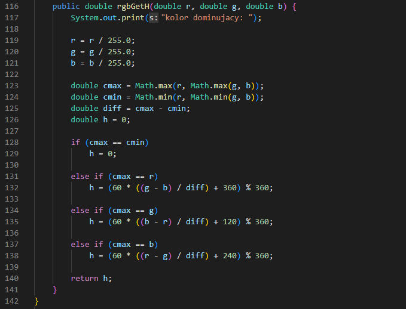

___

### kolorPrzeciwny()

To funkcja typu void. Odpowiada za:
* Rozpoznawanie przestrzeni barw koloru poprzez sprawdzienie wielkości tablicy przechowującej wartości kolorów w przestrzeniach barw 
* Wywołanie funkcji odpowiadających za obliczenie wartości koloru dopełniającego (przeciwnego)

___

### kpRGB()

To funkcja typu void. Odpowiada za:
* Obliczenie koloru przeciwnego wobec oryginalnego za pomocą wzoru na syntezę addytywną (barwy dopełniające dają biel (nakładanie świateł, zastosowanie w monitorach i telewizorach kolorowych)) [źródło](https://en.wikipedia.org/wiki/Complementary_colors)
    rDop = 255 - r;
    gDop = 255 - g;
    bDop = 255 - b;

___

### kpCMYK()

To funkcja typu void. Odpowiada za:
* konwersję przestrzeni barw koloru CMYK na RGB, ponieważ nie ma rzetelnych źródeł wiedzy na temat wzoru na syntezę subktraktywną dla przestrzeni barw CMYK
* Obliczenie koloru przeciwnego wobec oryginalnego za pomocą wzoru na syntezę addytywną (barwy dopełniające dają biel (nakładanie świateł, zastosowanie w monitorach i telewizorach kolorowych)) [źródło](https://en.wikipedia.org/wiki/Complementary_colors)
    rDop = 255 - r;
    gDop = 255 - g;
    bDop = 255 - b;

___

### Output:

Przewidywane wyniki (obliczone za pomocą kalkulatorów internetowych):

1.1)
**rgb: 118, 116, 235**  
**dominant: Blue**  
hex: #7674EB  
lumin1: 22,3  

1.2)
**rgb: 118,27,27**  
**dominant: Red**  
hex: #761B1B  
lumin2: 4,7  

1.3)
**lumin1 - lumin2: 17,6**  

2.1)
**cmyk: 5, 15, 100, 5**  
**dominant: Yellow**  
rgb: 230, 206, 0  
hex: #E6CE00  
lumin3: 60,96  

2.2)
**cmyk: 55, 10, 30, 35**  
**dominant: Green**  
rgb: 75, 149, 166  
hex: #4B9574  
lumin4: 24,2  

2.3)
**lumin1 - lumin2: 36% ** 

3.1)
**rgb comp: 137, 139, 20** 
rgb1 comp: #898b14  

**cmyk comp: 90, 81, 0, 0**  
cmyk1 comp: #1931ff  
rgb: 25, 49, 255  

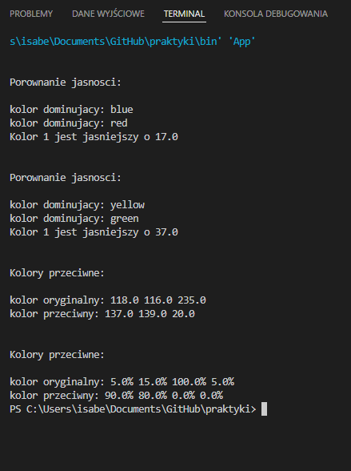

___

## **Zrzuty ekranu kodu:**

___

## App.java

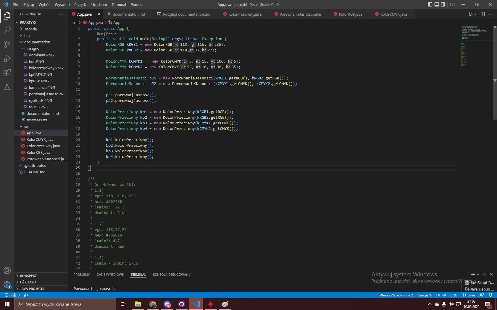

___

## KolorRGB.java

___

## KolorCMYK.java

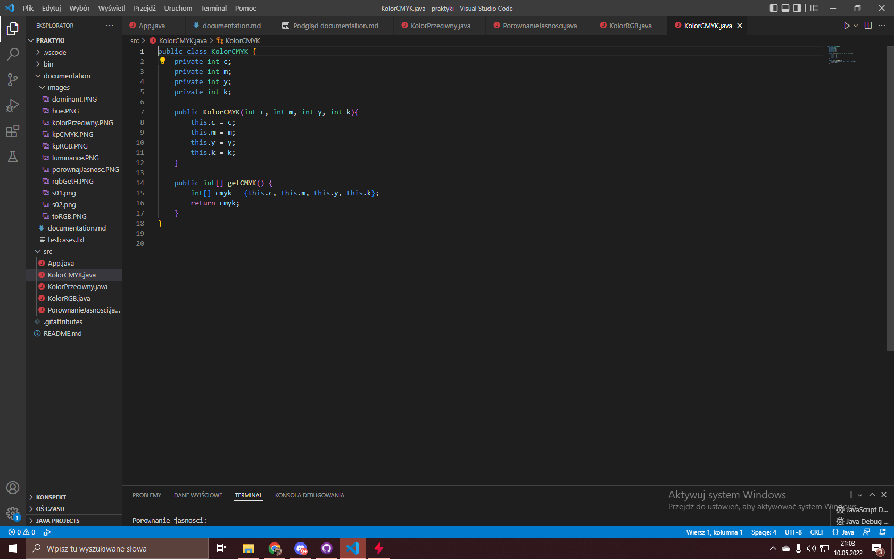

___

## PorownanieJasnosci.java

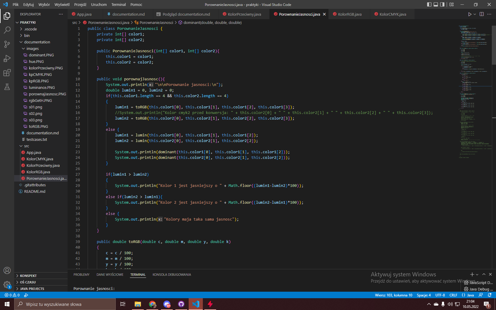
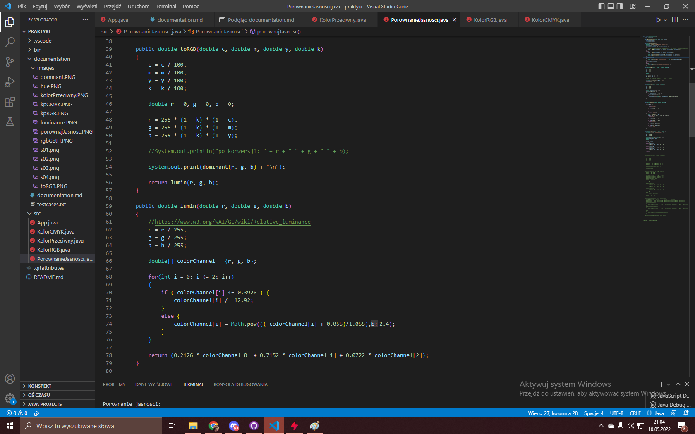
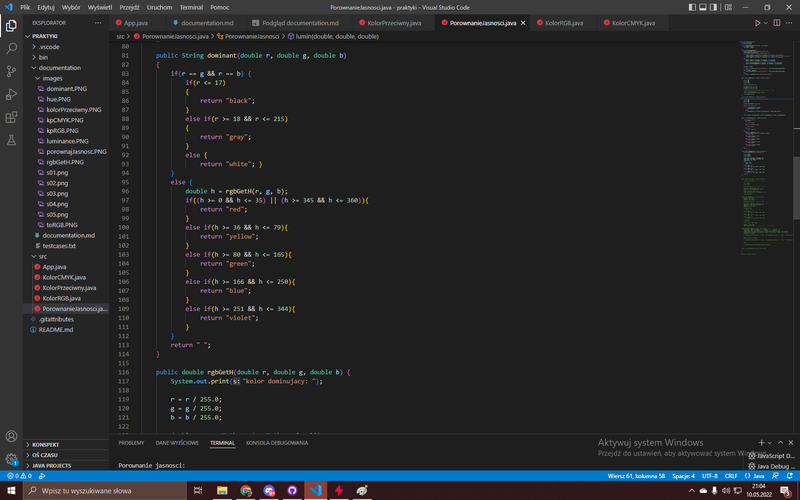
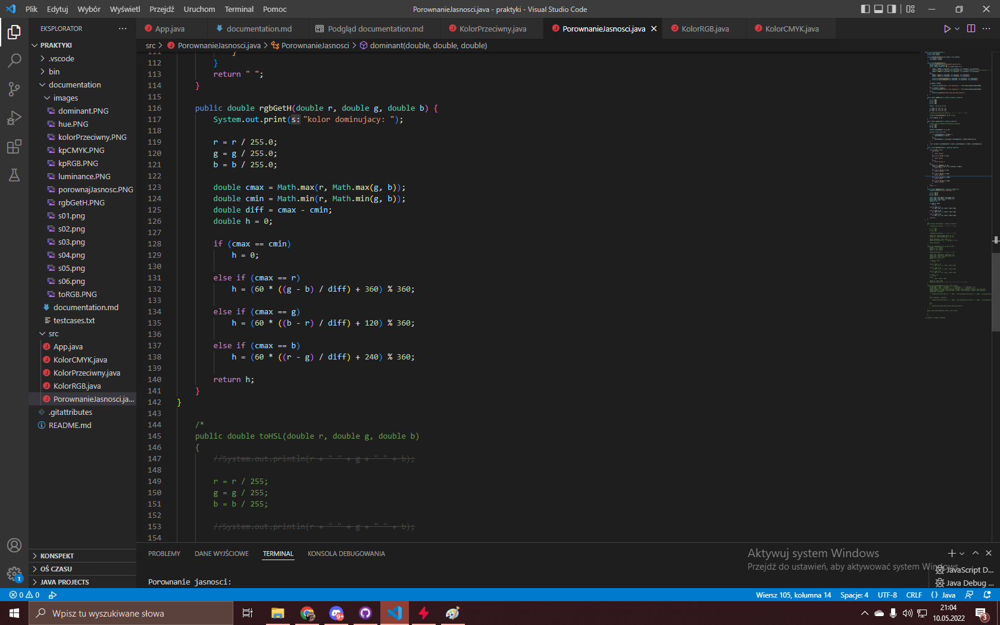

___

## KolorPrzeciwny.java

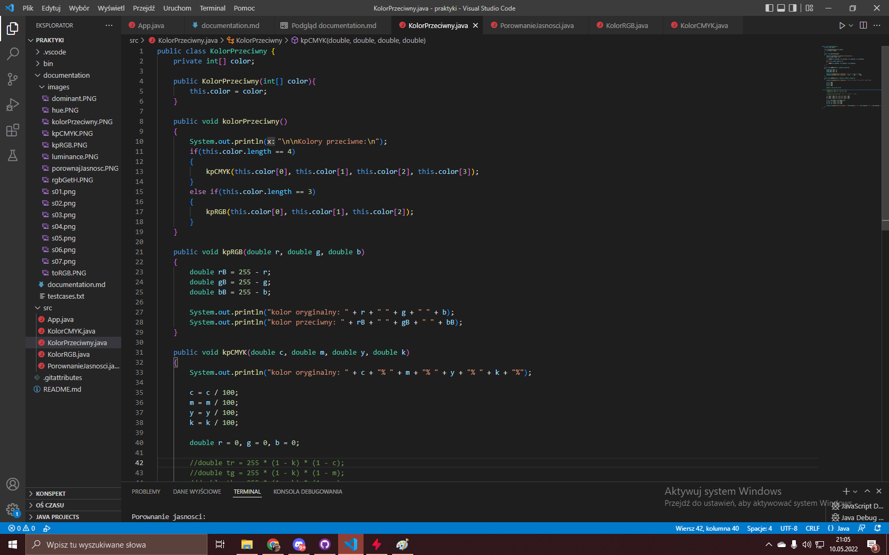
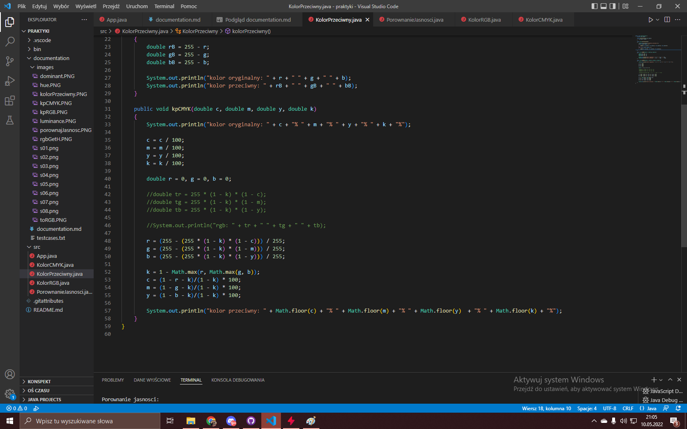

___

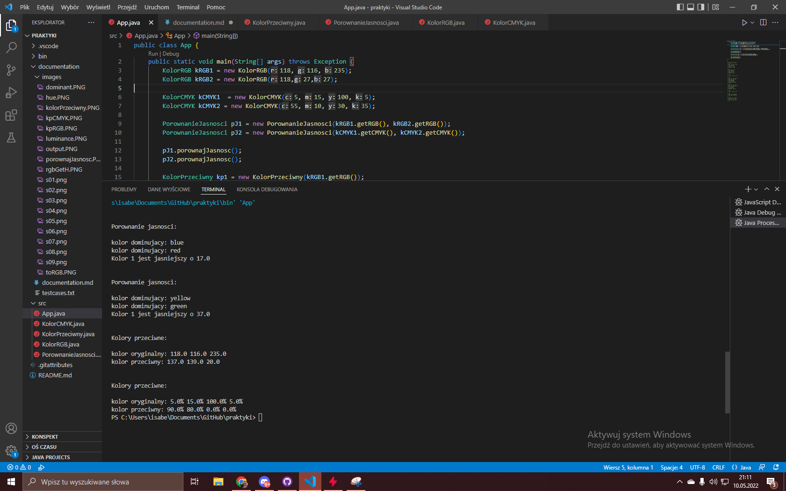